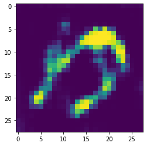
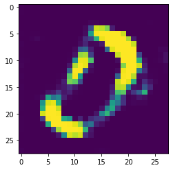
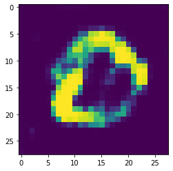
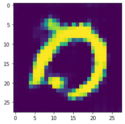
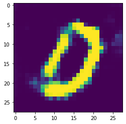
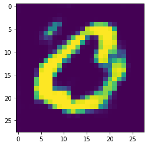
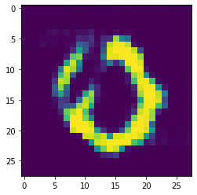
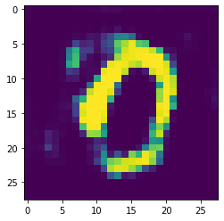
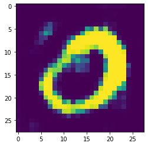
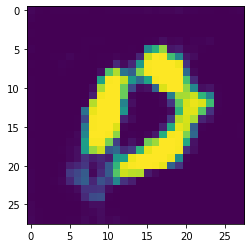

A simple Deep Convolutional Generative Adversarial Network (DCGAN)

This DCGAN model is built to using inorder the generate images of numbers from 0 to 9.

The dataset used for training the GAN is the famous MNIST dataset.

The logic is similar to an Autoencoder. In short the model is built using a CNN architecture along with the Autoencoders network priniciple.
It learns and identifies important features from the image of a number ( in this case number is 0 ) of the dataset and then use those set of important features to come up with its own image.
The image generated may not be exactly the same but we can make out that the number is 0. This means the model learned pretty well from the information provided to it.
It was trained for 20 epochs ( about 15 mins ) and it was able to come up with a satisfactory result. Obviously the performance can be improved.
Surely a new, more efficient, more accurate and robust model will be uploaded soon

The images generate by the model after traning are as follows: ( Number is 0 )

 

